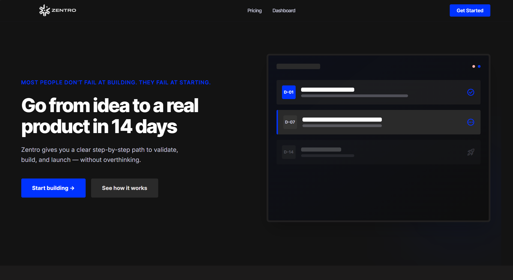
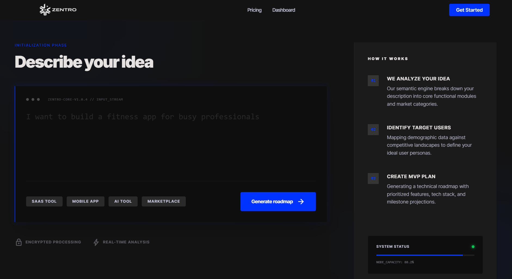

# Zentro

Go from idea to a shipped product in 14 days.

Zentro is a structured execution system for builders who want to move from concept to MVP without getting stuck in planning.

---

## Problem

Most people don’t fail at building — they fail at starting.

Ideas stall because there’s no clear path from 0 to 1.  
Scope is unclear, priorities are undefined, and execution becomes overwhelming.

---

## Solution

Zentro removes that ambiguity.

It breaks ideas into clear, actionable steps and guides you through a focused 14-day execution cycle — from concept to deployed product.

---

## Key Features

- **Roadmap Generation** — Turn ideas into structured execution plans  
- **MVP Scoping** — Focus only on what matters for shipping fast  
- **Execution Dashboard** — Track daily progress and milestones  
- **Guided Workflow** — Step-by-step path from idea → build → launch  

---

## Preview

### Landing Experience  
A clear starting point that communicates the product’s value instantly.  

### Idea to Plan  
Turn raw ideas into structured execution steps.  

### Execution Dashboard  
Track and manage your product-building journey.  

### System & Preferences  
Built with depth, control, and scalability in mind.  

---

## How it Works

1. **Define** — Describe your idea and target users  
2. **Generate** — Get a structured 14-day roadmap  
3. **Execute** — Follow focused daily steps  
4. **Ship** — Launch and start validating  

---

## Tech Stack

- Next.js 15, React 19, TypeScript  
- Tailwind CSS 4  
- Cloudflare Workers (Serverless)  

---

## Vision

I built Zentro for builders who are tired of overthinking and want to start shipping.

The goal is simple:  
turn ideas into real products — faster, with clarity.

---

## Future Scope

- Team collaboration for small founding teams  
- One-click deployments for common stacks  
- Real-time technical guidance during execution  

---

## Philosophy

Execution creates momentum.  
Momentum builds products.

---

Stop overthinking. Start shipping.
